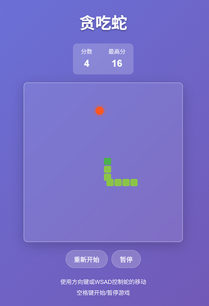
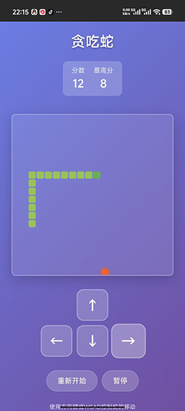

# 贪吃蛇小游戏 (Snake Game)

一个使用 Vue 3 + Vite 开发的现代化贪吃蛇游戏，具有响应式设计，支持桌面和移动设备。

## 功能特性

- 🎮 经典贪吃蛇游戏玩法
- 📱 响应式设计，支持移动端和桌面端
- ⌨️ 键盘控制（方向键和 WSAD）
- 📱 移动端触摸控制
- 🏆 分数系统和最高分记录（本地存储）
- 🎨 现代化 UI 设计，渐变背景和动画效果
- 🔄 游戏状态管理（开始、暂停、重新开始）
- 📦 打包优化，体积小巧

## 技术栈

- **前端框架**: Vue 3 (Composition API)
- **构建工具**: Vite
- **样式**: CSS3 (Scoped Styles)
- **存储**: localStorage

## 预览图

<details open>
<summary>点击查看游戏截图</summary>




</details>

## 如何运行

### 前置要求

- Node.js 14.18+ 或更高版本
- npm 7+ 或更高版本

### 安装依赖

```bash
npm install
```

### 开发模式运行

```bash
npm run dev
```

### 构建生产版本

```bash
npm run build
```

### 预览生产构建

```bash
npm run preview
```

## 游戏控制

### 桌面端
- **方向键**: 控制蛇的移动方向
- **WSAD**: 控制蛇的移动方向（W: 上, S: 下, A: 左, D: 右）
- **空格键**: 开始/暂停游戏

### 移动端
- 点击屏幕上的方向按钮控制蛇的移动

## 项目结构

```
snake-game/
├── dist/             # 构建输出目录
├── src/              # 源代码目录
│   ├── assets/       # 静态资源
│   ├── components/   # 组件
│   ├── App.vue       # 主应用组件
│   ├── main.js       # 应用入口
│   └── style.css     # 全局样式
├── index.html        # HTML 模板
├── package.json      # 项目配置和依赖
└── README.md         # 项目说明
```

## 游戏机制

1. **游戏初始化**: 蛇从屏幕中央开始，初始长度为 3
2. **食物生成**: 随机在空白格子生成食物
3. **移动机制**: 蛇头向指定方向移动，身体跟随
4. **碰撞检测**: 检测边界碰撞和自身碰撞
5. **得分系统**: 吃到食物得分+1，同时蛇身增长
6. **游戏结束**: 碰撞后游戏结束，显示得分并更新最高分

## 浏览器兼容性

- Chrome (最新版本)
- Firefox (最新版本)
- Safari (最新版本)
- Edge (最新版本)

## 许可证

MIT License

## 贡献

欢迎提交 Issue 和 Pull Request 来改进这个游戏！

---

**享受游戏！** 🎉